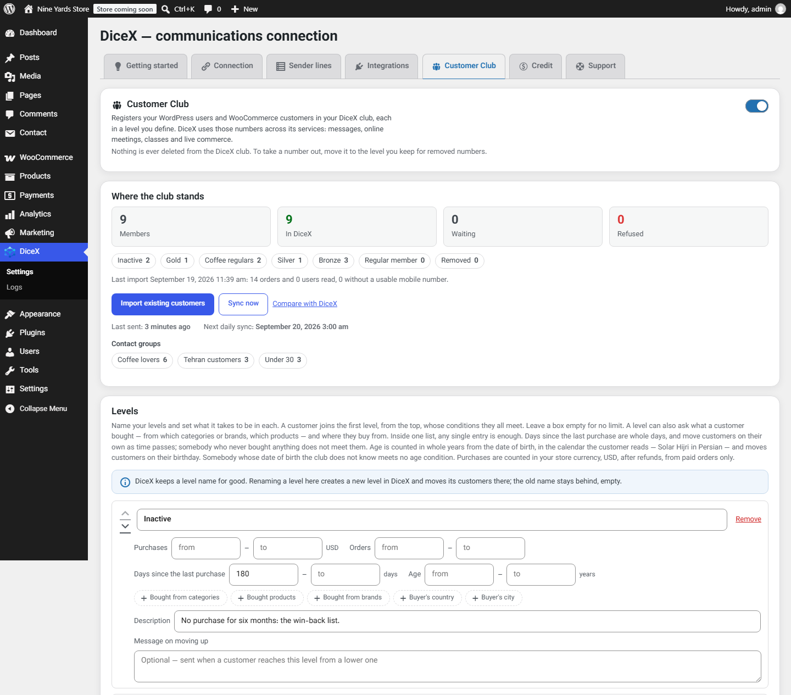
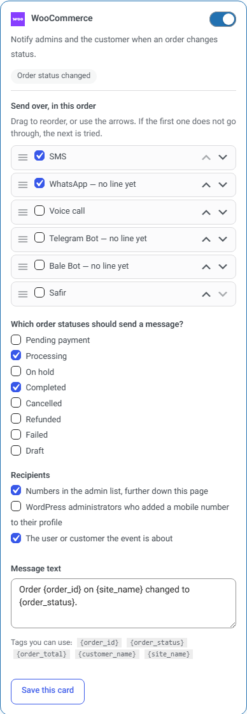

# DiceX Connect

A customer club with levels you define, plus SMS, WhatsApp and Telegram alerts for orders, forms and logins — through your own DiceX account.

This is the source of the plugin published at
**[wordpress.org/plugins/dicex-connect](https://wordpress.org/plugins/dicex-connect/)**. Every
release is tagged here.

DiceX Connect keeps your customers and your site's messages together, in your own
[DiceX](https://dicex.me/) account. Three parts, each switched on by itself.

## A customer club

Your WordPress users and WooCommerce customers join your DiceX club, in levels you define, and move
between them as they buy.

- **Levels you define** — by spend, orders, days since the last purchase, age, categories, products,
  brands, country or city. Each customer sits in the first level they meet.
- **Groups beside the levels** — a customer is in every group they match, such as coffee buyers or
  shoppers from one city.
- **Messages that fit** — a welcome on joining and a note on moving up a level, in the customer's own
  language.
- **Date of birth** — asked at checkout, on registration and in the account, in the Solar Hijri or
  the Gregorian calendar.
- **Consent and control** — everybody joins, or only those who tick the box, and anyone can leave
  from their account. The first import waits until you have checked the counts.
- **Big stores** — `wp dicex club` imports, syncs and reports from the command line.

## Messages for your site's events

- **WooCommerce order notifications** on the order statuses you choose, High-Performance Order
  Storage included.
- **Form notifications** for WPForms, Contact Form 7 and Gravity Forms. The customer's number is
  found in the submitted fields; there is nothing to map.
- **Security alerts** — repeated failed logins from one address, an administrator signing in, a new
  user, a password reset. No security plugin needed.
- **Two-step login** — a one-time code on the login screen, after the password or instead of it. One
  line in `wp-config.php` turns it off, so a lost phone never locks you out.
- **More than SMS** — the same message can go over WhatsApp, voice call, Telegram, Bale or Safir,
  depending on what your DiceX account has. Each card is given an ordered list of channels and tries
  the next one when the first does not get through.

## Install

From your dashboard: **Plugins → Add New**, search for *DiceX Connect*, then **Install Now** and
**Activate**. Or download the current release from
[WordPress.org](https://wordpress.org/plugins/dicex-connect/) or from
[Releases](https://github.com/mydicex/dicex-connect/releases) and upload the zip.

Then open the **DiceX** menu, paste your API key under Connection, pick a sender line per channel,
and switch on the cards you want.

## Requirements

| | |
| --- | --- |
| WordPress | 5.8 or newer |
| PHP | 7.4 or newer |
| WooCommerce | optional; needed for orders, and for club conditions about purchases and place |
| A DiceX account | required — DiceX is a separate, paid service, and the plugin sends nothing until you paste your own API key |

## What leaves your site

Nothing, until you connect an account. After that, only what a send needs: your API key, the
recipient's number, the message and the sender line — plus, if you switch the Customer Club on, the
customer details listed under **External services** in [readme.txt](readme.txt). The plugin adds no
analytics, no tracking and no telemetry, and loads no script, style or font from a CDN.

## Translations

The screens follow WordPress's language and read right to left in Persian, Arabic and Hebrew.
Translations are contributed at
[translate.wordpress.org](https://translate.wordpress.org/projects/wp-plugins/dicex-connect/) —
please add yours there rather than in a pull request, so every site gets it automatically. The
Persian catalogue in [`translations/`](translations) is what is imported there.

## Getting help

- **Support tab** — the plugin has one, from version 1.8.0: it writes to DiceX support from inside
  your dashboard and can attach the plugin's log.
- **Support forum** — <https://wordpress.org/support/plugin/dicex-connect/>
- **Email** — wp-support@dicex.me
- **A security problem** — please read [SECURITY.md](SECURITY.md) first and do not open a public
  issue.

## Contributing

Bug reports and pull requests are welcome; see [CONTRIBUTING.md](CONTRIBUTING.md). The changelog for
every release is in [changelog.txt](changelog.txt).

## License

GPL-2.0-or-later. See [LICENSE](LICENSE). The bundled Vazirmatn font is under the SIL Open Font
License 1.1, with its licence text in `assets/fonts/OFL.txt`.
